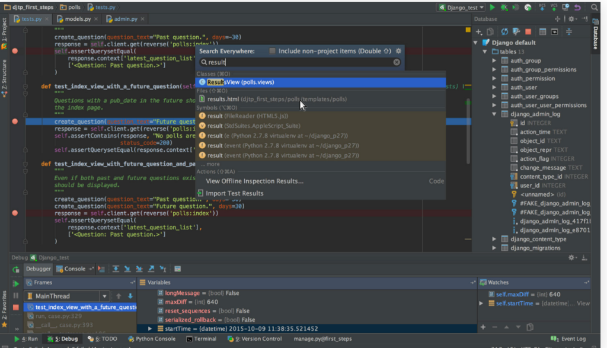
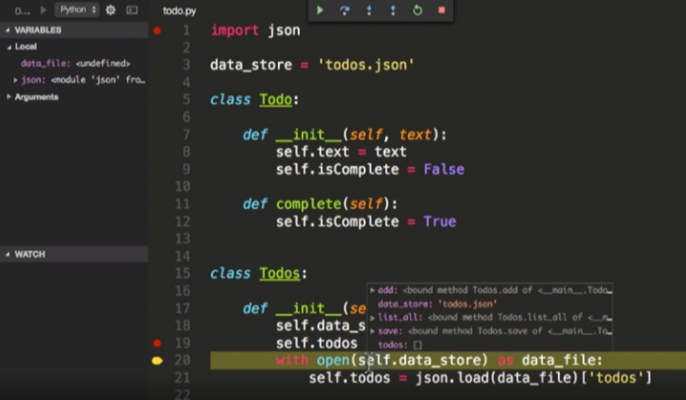
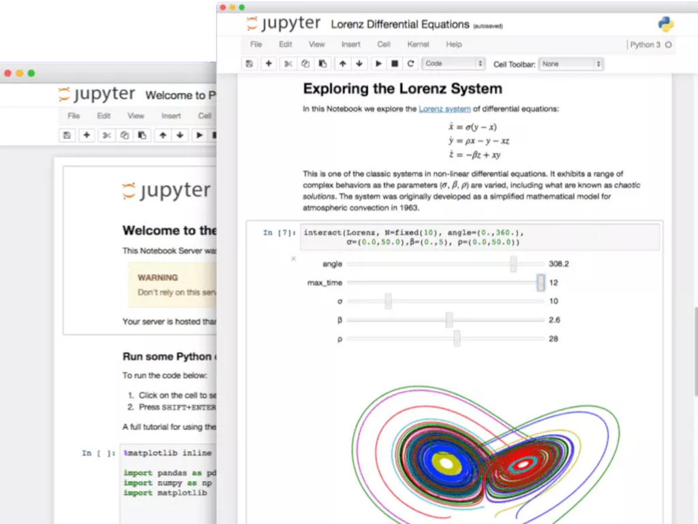
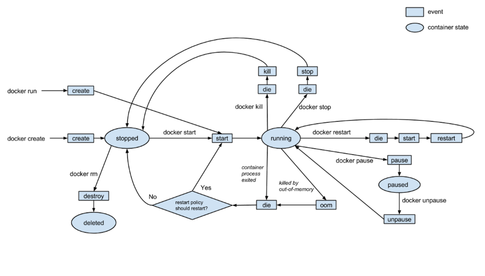
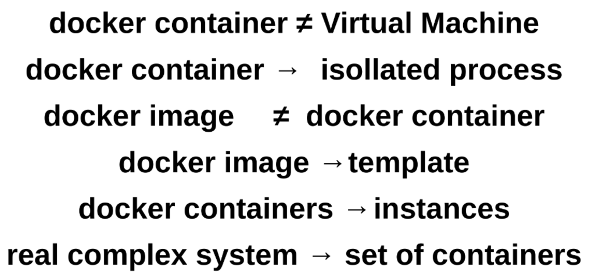
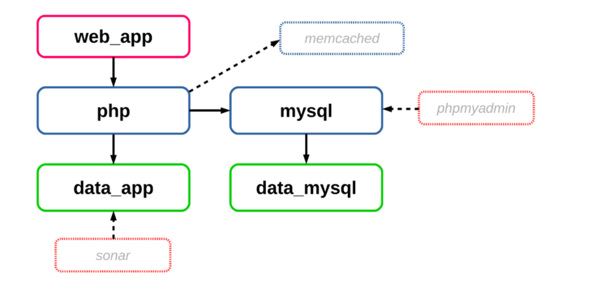
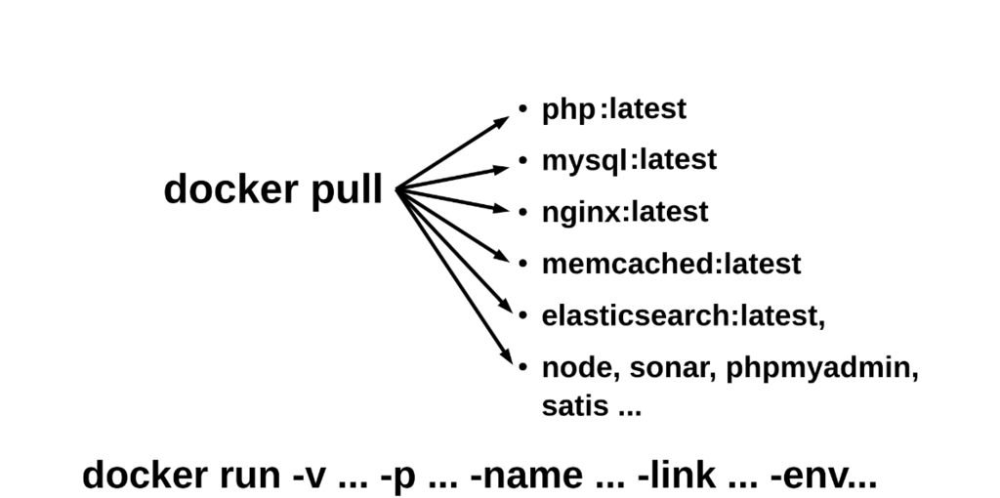
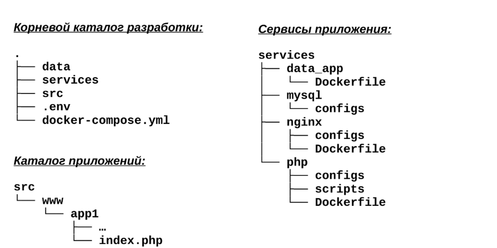

# Лекція 2. Засоби віртуалізації та інструменти розробки для Python

---

## Python

Python широко використивується для різних задач з ряду причин

- легкий для входу новачків
- для задач для будь-яких OS
- Web сервіси
- BigData
- ML & DL
- для embeded devices & IoT
- ...

## Python та інструменти розробки

Деякі стандартні та зручні інструменти

1. [PyChram](https://www.jetbrains.com/pycharm/)



2. [Visual Studio Code](https://code.visualstudio.com/docs/languages/python)



3. [Jupiter Notebooks](https://jupyter.org/)



4. Online інструменти

---

## Python: засоби віртуалізації

### Проблема

- розробники Python активно використовують зовнішні бібліотеки для додавання функцій та виправлення помилок
- можуть знадобиться різні версії інструментів. Деколи не можливо використовувати інструмент А (який використовує найновішу версію фреймворку B)
- стандартна проблема не тільки Python
- вирішують за допомогою віртуальних середовищ

#### Віртуальне середовище

Визначення віртуальних середовищ згідно з документацією Python:
> Спільно ізольоване середовище виконання, яке дозволяє користувачам і програмам Python встановлювати та оновлювати дистрибутивні пакети Python, не втручаючись у поведінку інших програм Python, що працюють у тій же системі.

### Інструменти для віртуальних середовищ

Порівняємо декілька найпопулярніших інструментів віртуальних середовищ

1. Чисті системи віртуалізації: VirtualBox, VMWare, QEMU
2. Virtualenv
3. Pipenv
4. Conda та miniconda
5. Dockerazation: docker, docker-compose, ...

#### Virtualenv

- (+) найпоширеніший і простий у встановленні інструмент для віртуальних середовищ
- (+) чудовий інструмент для початківців
- (+) простий у використанні в розгорнутих середовищах
- (-) має невелику кількость функцій для натроювання
- (-) встановлюєте окремо від пакетів Python
- (-) не зручно, якщо часто потрібно змінювати свій шлях (active/deactive)
- (+/-) існує плагін `virtualenvWrapper`, яке має більше функцій для легкого керування вашим середовищем

#### Pipenv

- (+/-) інструмент, який використовується для керування віртуальними середовищами та пакуванням у Python. Він спрямований на інтеграцію функціональних можливостей Pip і Virtualenv в одному інструментіб але більш складний
- (+) має розширені функції та функції для створення, видалення, активації та деактивації вашого середовища
- використовує файл Pipfile.lock для обробки всіх встановлених пакетів. Це робить простішим встановлення залежностей з інших проектів
- (+) вміє будувати графіки залежностей
- (+) містить пакет безпеки та сканує кожен пакет у ваших залежностях, щоб знайти вразливі місця
- (+) вміє змінювати шляхи до модулів без переактивації
- (-) складний для початківців
- (-) може бути дуже заплутаним під час використання для простих задач

#### Conda, miniconda

— (+/-) пакет/середовище (~720 модулів), для керування залежностями та середовищем дайже для будь-якої мови: Python, R, Ruby, Lua, Scala, Java, JavaScript, C/C++, FORTRAN тощо.

- (+) має вбудовану підтримку для керування пакетами
- (+) його пакети є бінарними, тобто вже майже не потрібно встановлювати компілятори для використання будь-якого з них
- (+) підтримує всі функції традиційних бібліотек Virtualenv
- (+) можете встановити різні версії Python, кожна з яких ізольована від інших і все в одному інструменті
- (-) його рекомендовано використовувати, лише якщо ви плануєте деякий час використовувати пакет Anaconda в цілому
- (-) існують конфлікти між іншими пакетами, настроювати значно складніше ніж з pip
- (+/-) можна замінити простішою версією - `miniconda`

### Dockerization

Алгоритм роботи для початківця:

- [docker engine](https://docs.docker.com/engine/)
- [docker compose](https://docs.docker.com/compose/)
- [матеріали з конференції СумДУ-2016](https://github.com/wellic/conf-2016-docker-php/blob/master/conf-2016-docker-php.pdf)

---

#### Docker Engine

> Docker Engine — це технологія контейнеризації з відкритим кодом для створення та контейнеризації ваших програм. Docker Engine діє як клієнт-серверна програма, яка складається з:
> - `dockerd`: сервер-демон
> - `API`: інтерфейси, що програми можуть використовувати для спілкування з демоном `dockerd`
> - `docker`: клієнт інтерфейсу командного рядка (CLI)
>
> CLI використовує Docker API для керування демоном Docker або взаємодії з ним за допомогою сценаріїв або прямих команд CLI. Багато інших програм Docker використовують базові API та CLI. Демон створює та керує об’єктами Docker, такими як іміджи (images), контейнери(containers), мережі(networks) та томи(volumes).

##### Cхема роботи з докер



##### Помилки при використанні та що треба зрозуміти



##### Приклад: структура звичайного сервісу на PHP



##### Приклад: стандартний workflow роботи з docker



---

#### Docker-сompose

##### Проблеми при роботі с 'чистим' докером

- у реальній розробці зазвичай використовується кілька контейнерів з сервісами
- контейнери пов'язані між собою, тому потрібно правильно керувати чергу завантаження
- необхідно знати та використовувати багато технічної інформації (назви контнейнерів, порти, залежності тощо)
- при оновленні сценарію програми - необхідно самостійно оновити образи та перезапустити пов'язані контейнери
- часто виникають при "тонкому" налаштуванні образів та контейнерів
- виникає необхідність писати та налагоджувати додаткові скрипти запуску
 
##### Skeleton



##### Приклади 

1. запуск python використовуючи Dockerfile:
```Dockerfile
FROM python:3.8

WORKDIR /app

pip install -U pip
pip install -r requirements
```

```bash
docker build -t lab-py .
```

```bash
docker run --name lab-py -v "$PWD:/app" -w "/app" lab-py
docker exec -it lab-py bash
docker stop lab-py
docker rm lab-py
```

2. запуск python використовуючи Dockerfile:
```yaml
version: '3'
services:
  lab-py:
    image: "python3.8"
    container_name: "lab-py"
    working_dir: "/app"
    volumes:
      - ".:/app"
```

```bash
docker-compose up -d 
docker-compose exec -it lab-py bash
docker-compose down
```

3. запуск зв'їязаних сервисів:

```yaml
version: '3'

services:
  http-proxy:
    image: nginxproxy/nginx-proxy:latest
    container_name: http-proxy
    privileged: true
    environment:
      - "CONTAINER_NAME=http-proxy"
    ports:
      - "80:80"
    volumes:
      - "/var/run/docker.sock:/tmp/docker.sock:ro"

  lab-py:
    image: "lab-py"
    build:
      context: ..
      dockerfile: Dockerfile
    container_name: lab-py
    working_dir: /app
    environment:
      - VIRTUAL_HOST=lab-py.docker
    depends_on:
      - http-proxy
      - lab-aws
      - lab-db
    volumes:
      - .:/app

  db:
    image: mysql:5.7
    container_name: lab-db
    environment:
      - VIRTUAL_HOST=lab-db.docker
    depends_on:
      - http-proxy

  lab-aws:
    image: localstack/localstack:latest
    container_name: lab-aws
    environment:
      - VIRTUAL_HOST=lab-aws.docker
      - VIRTUAL_PORT=4566
      - DOCKER_HOST=unix:///var/run/docker.sock
    healthcheck:
      test: [ "CMD", "curl", "http://localhost:4566/health?reload" ]
      interval: 10s
      timeout: 5s
    ports:
      - "4566:4566"            # LocalStack Gateway
      - "4510-4559:4510-4559"  # external services port range
    volumes:
      - "/var/run/docker.sock:/var/run/docker.sock"
    depends_on:
      - http-proxy

  # Details about local stack:
  # - https://github.com/localstack/localstack/blob/master/docker-compose.yml
  # - https://docs.localstack.cloud/localstack/configuration/
```

```bash
docker-compose up -d 
docker-compose ps
```
```text
http-proxy            /app/docker-entrypoint.sh  ...   Up                      0.0.0.0:80->80/tcp,:::80->80/tcp
lab-aws               docker-entrypoint.sh             Up (health: starting)   0.0.0.0:4566->4566/tcp,:::4566->4566/tcp, 5678/tcp                                          
lab-db                docker-entrypoint.sh             Up                      0.0.0.0:32771->5432/tcp,:::32771->5432/tcp5432/tcp
lab-py                python3                          Up                      0.0.0.0:32772->80/tcp,:::32772->80/tcp
```                                                                                

##### Приклад: запуску WEB-сервіса викороистовуючи docker-composer


### Висновки то розділу: Python та засоби віртуалізації

- розробник може використовувати декілька версій Python та бібліотек в одному проекті
- розробник може передати колегам середовище в якому він працював
- існують системи, які автоматизовано відстежують зміни версій програм і бібліотек
- процес імплементації робочого середовища розробника до реального робочого середовища не потребує особливих знань з адміністрування серверів
- процеси CI/CD досить легко автоматизуються

---

# [Література та посилання](../links.md)

---

# [На головну сторінку ...](../README.md)
