# Лекція 7. Візуалізація даних. Бібліотеки візуалізації: MatPlotLib, Seaborn, Bokeh ...

--- 

## Бібліотеки візуалізації

### Статичні та інтерактивні діаграми

Перш ніж ми приступимо до аналізу бібліотек, розберемося з основними видами діаграм, які бувають статичні та інтерактивні.

_**Статичні діаграми**_ - це графіки, які не змінюються, а є звичайними картинками.

Проте, з _**інтерактивними діаграмами**_ можна взаємодіяти, змінюючи їх у режимі онлайн, тому такі діаграми часто використовують JavaScript і відображаються лише у браузері або Jupyter.
   Інтерактивні діаграми мають приємний вигляд і зручні для тривалого дослідження даних, але можуть мати складний інтерфейс, який доведеться вивчити. 
 
Заради справедливості відзначимо, що бібліотеки Matplotlib і Seaborn створюють статичні діаграми, але в Jupyter Notebook з додатковими налаштуваннями вони можуть стати інтерктивними.

---

### Список бібліотек візуалізаціії для досліджень даних 

У мові програмування Python є різні типи бібліотек всіх видів проектів. Так само в python є різні бібліотеки для візуалізації даних, тому користувач може докладно розглянути набір даних і правильно його проаналізувати.

Кожна бібліотека візуалізації має власну специфікацію.
Використання певних бібліотек для конкретного завдання допомагає користувачеві виконати її більш простим та точним способом.
Деякі спрощують роботу краще за інші.

Бібліотеки для візуалізації даних у програмуванні на Python наведені нижче:

- [Matplotlib](https://matplotlib.org/)
- [Seaborn](https://seaborn.pydata.org/)
- [Missingno](https://github.com/ResidentMario/missingno)
- [Bokeh](https://bokeh.org/)
- [Plotly](https://plotly.com/)
- [Altair](https://altair-viz.github.io/)
- [ggplot](https://yhat.github.io/ggpy/)
- [Pygal](https://www.pygal.org)
- [Leather](https://leather.readthedocs.io/en/)
- [Folium](https://python-visualization.github.io/folium/)
- [Geoplotlib](https://github.com/andrea-cuttone/geoplotlib)
- [Gleam](https://github.com/dgrtwo/gleam)

## Matplotlib


[Matplotlib](https://matplotlib.org/) – це бібліотека, яка використовується для побудови графіків мовою програмування Python. Використовується побудова 2-х мірних масивів. Matplotlib побудований на масивах NumPy. Він призначений для роботи зі стеком SciPy. Він був розроблений Джоном Хантером у 2002 році.

Перевага візуалізації полягає в тому, що користувач може мати візуальний доступ до великих обсягів даних. Побудувати графік у Matplotlib також просто як і гістограму, лінію, розсіювання і т.д.

Matplotlib має безліч різноманітних графіків. Графіки корисні для розуміння закономірностей, тенденцій та встановлення кореляцій. Він має інструменти для міркування про кількісної інформації.

Оскільки matplotlib була найпершою бібліотекою візуалізації даних на Python, багато інших бібліотек було розроблено поверх неї або призначено для роботи паралельно з нею для аналізу набору даних.

##### Приклад 1

```python
import matplotlib.pyplot as pyplt
import numpy as np

np.random.seed(16)
pyplt.ylabel(' stepfilled ')
pyplt.show() 
```

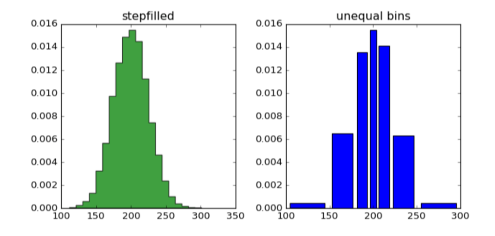

##### Приклад 2

```python
import matplotlib.pyplot as plt

top_followers = new_profile.sort_values(by='followers', axis=0, ascending=False)[:100]

fig = plt.figure()

plt.bar(top_followers.user_name, top_followers.followers)
```

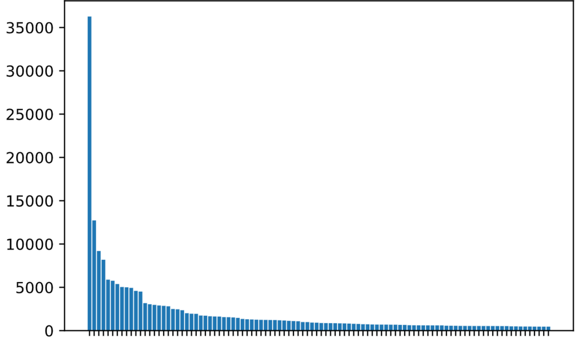

---

## Seaborn


[Seaborn](https://seaborn.pydata.org/) – це бібліотека Python, яка переважно використовується для створення статистичної графіки набору даних. Ця бібліотека побудована на основі бібліотеки Matplotlib. Вона також тісно інтегрована з Pandas, яка використовується для структури даних Datasets.

Seaborn дуже допомагає краще досліджувати та розуміти дані. Забезпечує високий рівень перетину для створення нарисів привабливої інформативної графіки алгебри.


---

## Missingno

[Missingno](https://github.com/ResidentMario/missingno)

Щоразу при старті нового проекту Data Science потрібно буде провести деяке дослідження даних, щоб краще зрозуміти дані. При цьому часто доводиться стикатися з відсутністю деяких значень datasets. 

Для оцінки відсутніх значень стане пакет Missingno, яка відфільтрує і візуалізує їх у вигляді барів, матриці, теплової матриці (heatmap) або дендограми (dendrogram).

Missingno може стати в нагоді в таких випадках:

- потрібне повне дослідження даних на наявність перепусток (відсутніх значень);
- необхідно швидко зрозуміи де є і перевірити кореляцію між атрибутами.


---

## Bokeh


[Bokeh](https://bokeh.org/) — це бібліотека на основі Javascript, яка дозволяє реалізовувати інтерактивну візуалізацію.

Bokeh має три рівні керування для різних типів користувачів:

1. найвищий рівень дозволяє створювати стандартні діаграми, такі як стовпчасті, точкові і т.п.
2. середній рівень пропонує певний рівень специфічності, як Matplotlib, і дозволяє контролювати основні будівельні блоки кожної діаграми
3. найнижчий рівень дає вам повний контроль над кожним елементом діаграми

:heavy_plus_sign: Використовувати Bokeh слід, якщо:

- потрібні анімації та красиві інтерактивні діаграми;
- потрібен повний контроль за побудовою графіків.

:heavy_minus_sign: Однак, рекомендується вибирати інші бібліотеки, якщо:

- немає часу розбиратися з усіма налаштуваннями;
- хочете будувати тривимірні графіки (у цьому випадку чудово підійде Plotly).

##### Приклад 1


##### Приклад 2

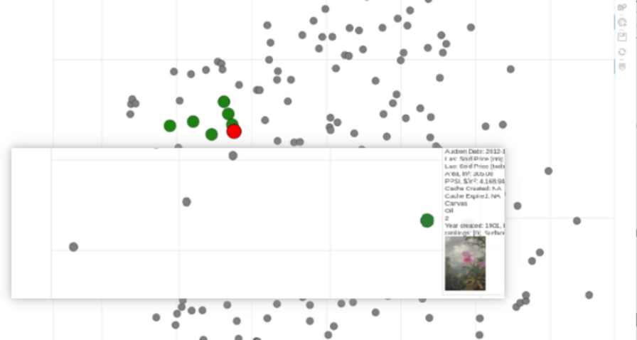

---

## Ploltly


[Plotly](https://plotly.com/) – це бібліотека для створення інтерактивних візуалізацій та управління ними в режимі онлайн.
У цій написаній на JavaScript бібліотеці є безліч вбудованих програм для машинного навчання (Machine learning) та аналізу даних, що спрощує реалізацію та візуалізацію різних алгоритмів.
А разом із фреймворком Dash можна створити фронтенд ML-додаток, наприклад, опублікувавши GPT-3 (Generative Pre-Training).

Ця бібліотека використовується для розробки інтерактивних графіків та діаграм. Це бібліотека побудови графіків з відкритим вихідним кодом, яка дозволяє використовувати близько 40 унікальних типів діаграм та графіків, що охоплюють величезний діапазон алгебраїчних, економічних, географічних 3-мірних та наукових випадків використання.Причини використання Plotly:

Ця бібліотека використовується для малювання чатів та графіків, таких як дендрограми, тривимірні діаграми та контурні графіки.потрібно будувати інтерактивні діаграми на Python; потрібні анімації; хочете створювати красиві карти, наукові чи фінансові графіки та 3D-діаграми, щоб показати їх широкому загалу.

Бібліотека Plotly для Python розроблена поверх бібліотеки Plotly JavaScript.

:heavy_plus_sign: Причини використання Plotly:

- потрібно будувати інтерактивні діаграми на Python; потрібні анімації;
- хочете створювати красиві карти, наукові чи фінансові графіки та 3D-діаграми, щоб показати їх широкому загалу.

:heavy_minus_sign: Не рекомендується використовувати Plotly, якщо:

- вам не потрібні складні графіки та інтерактивність, а важливий результат;
- не бажаєте розбиратися зі складним інтерфейсом.

##### Приклад 1

```python
import plotly.graph_objects as ply

# Add data
months = [' Jan ', ' Feb ', ' Mar ', ' Apr ', ' May ', ' June ', ' July ', ' Aug ', ' Sep ',
    ' Oct ', ' Nov ', ' Dec ']
high_2010 = [31.5, 36.6, 48.9, 52.0, 68.1, 74.4, 75.5, 75.6, 69.7, 59.6, 44.1, 28.3]
low_2010 = [12.8, 21.3, 31.5, 36.2, 50.9, 55.1, 56.7, 57.3, 50.2, 41.8, 30.6, 14.9]
high_2015 = [35.5, 25.6, 42.6, 51.3, 70.5, 80.4, 81.5, 81.2, 75.0, 66.3, 45.1, 34.0]
low_2015 = [22.6, 13.0, 26.0, 35.8, 46.6, 56.7, 57.9, 60.2, 52.3, 47.5, 30.0, 22.6]
high_2020 = [27.8, 27.5, 36.0, 55.8, 68.7, 78.7, 77.5, 76.8, 73.1, 61.6, 44.3, 38.9]
low_2020 = [11.7, 13.3, 17.6, 34.5, 48.9, 57.0, 59.0, 57.6, 50.7, 44.2, 31.2, 28.1]

fig = ply.Figure()

# Create and style traces
fig.add_trace(ply.Scatter(x=months, y=high_2020,
                          name='High 2020', line=dict(color=' firebrick ', width=4)))
fig.add_trace(ply.Scatter(x=months, y=low_2020,
                          name=' Low 2020', line=dict(color=' royalblue ', width=4)))
fig.add_trace(ply.Scatter(x=months, y=high_2015,
                          name='High 2015', line=dict(color='firebrick', width=4, dash='dash')))
fig.add_trace(ply.Scatter(x=months, y=low_2015,
                          name='Low 2015', line=dict(color='royalblue', width=4, dash='dash')))
fig.add_trace(ply.Scatter(x=months, y=high_2010,
                          name='High 2010', line=dict(color='firebrick', width=4, dash='dot')))
fig.add_trace(ply.Scatter(x=months, y=low_2010,
                          name='Low 2010', line=dict(color='royalblue', width=4, dash='dot')))
fig.update_layout(title='Average High and Low Temperatures in NYC',
                  xaxis_title=' months ',
                  yaxis_title=' Temperatures( degrees F ) ')
fig.show()
```

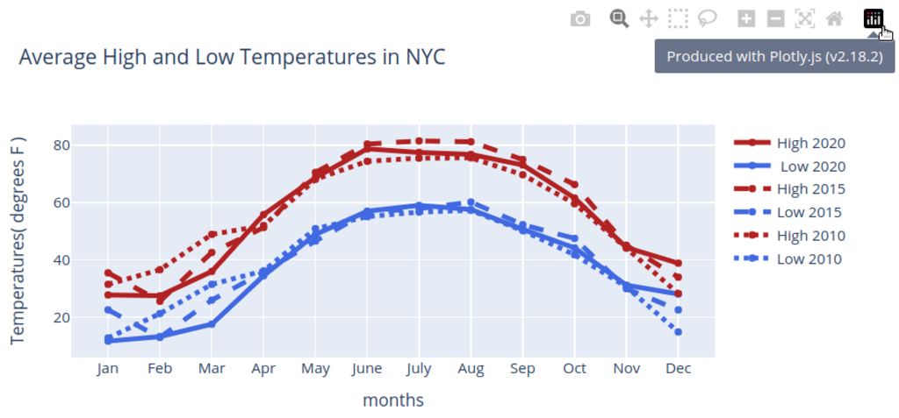

##### Галерея прикладів

- [examples](https://plotly.com/examples/)
- [demo](https://shapash-demo.ossbymaif.fr/)

---

## Altair


[Altair](https://altair-viz.github.io/) – бібліотека візуалізації, яка надає унікальний декларативний синтаксис для створення інтерактивних графіків. Він використовує специфікацію граматики VEGA-LITE, дозволяючи вам складати діаграми з графічних одиниць та комбінувати їх модульним способом.

Підхід Altair дозволяє зосередитись на передбачуваному результаті візуалізації та залишити перетворення даних бібліотеці. Це особливо корисно при дослідженні даних, коли ви намагаєтеся поєднати різні способи вивчення та візуалізації задачи.

:heavy_plus_sign: Altair – гарний вибір, якщо:

- ви проводите багато досліджень даних та експериментів та хочете поділитися результатами в інтерактивному форматі;
- вам не потрібне низькорівневе налаштування;
- вам подобається парадигма граматики графіки та ви віддаєте перевагу синтаксису Altair.

##### Приклад 1

```python
import altair as alt
import pandas as pd

source = pd.DataFrame({
    'a': ['A', 'B', 'C', 'D', 'E', 'F', 'G', 'H', 'I'],
    'b': [28, 55, 43, 91, 81, 53, 19, 87, 52]
})

alt.Chart(source).mark_bar().encode(
    x='a',
    y='b'
)
```

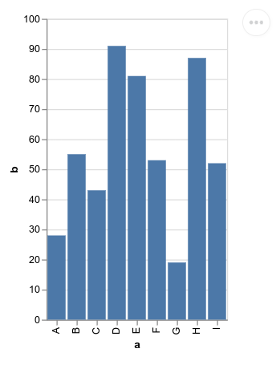

##### Приклад 2

```python
import altair as alt
from vega_datasets import data

source = data.cars()

alt.Chart(source).mark_circle(size=60).encode(
    x='Horsepower',
    y='Miles_per_Gallon',
    color='Origin',
    tooltip=['Name', 'Origin', 'Horsepower', 'Miles_per_Gallon']
).interactive()
```


---

## ggplot


[Ggplot](https://yhat.github.io/ggpy/) - це операція Python граматики для графіки.

Вона заснована на ggplot2, система побудови графіків мовою програмування R.

У неї інший робочий процес, у порівнянні з matplotlib тому, що він дозволяє користувачеві накладати компоненти на слої(layers) для створення повного графіка. Користувач може розпочати налаштовувати осі, додати крапки, потім лінію, потім лінію тренду тощо.

Ggplot не призначена для розробки настроюваної графіки високого рівня. У неї простіший спосіб побудови без складності. 

Він інтегрований з Pandas. 

Отже, при використанні ggplot найкраще зберігати дані у DataFrame.

##### Приклад 1

Приклад стандартного застосовування

```python
from plotnine.data import economics
from plotnine import ggplot, aes, geom_line

(
    ggplot(economics)  # What data to use
    + aes(x="date", y="pop")  # What variable to use
    + geom_line()  # Geometric object to use for drawing
)

```

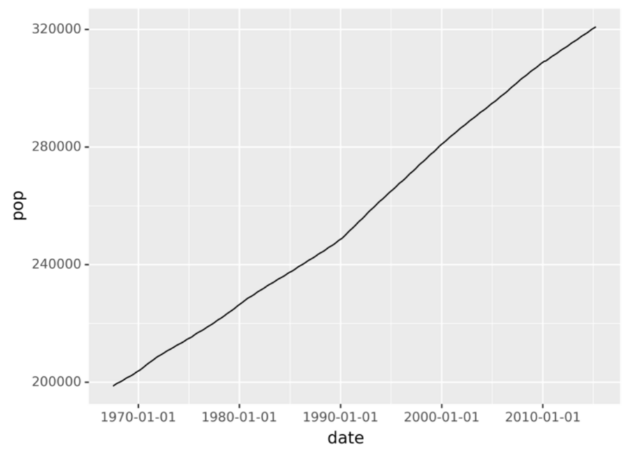

##### Приклад 2

Приклад генерації графіків

```python
from plotnine import ggplot, geom_point, aes, stat_smooth, facet_wrap
from plotnine.data import mtcars

(ggplot(mtcars, aes('wt', 'mpg', color='factor(gear)'))
 + geom_point()
 + stat_smooth(method='lm')
 + facet_wrap('~gear'))
```

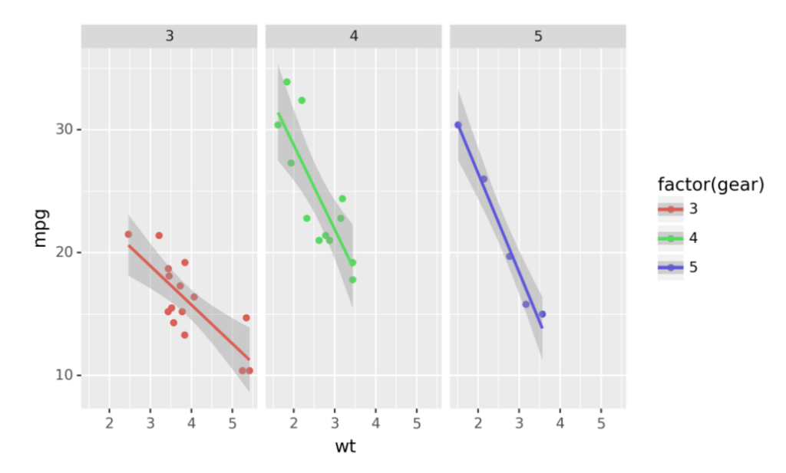

---

## Pygal

[Pygal](https://www.pygal.org) - це найбільш специфічна Python-бібліотека з різноманітними видами графіків, які доповнюють основні Data Science дослідження.

Pygal повертає XML, який можна показати у браузері або зберегти графік у форматі SVG.

Також можливий експорт у PNG, проте тут потрібно встановити додаткові залежності.

##### Приклад 1

Нижче малюнок із так званим графіком Radar.

```python
import pygal

radar_chart = pygal.Radar()
radar_chart.title = 'V8 benchmark results'
radar_chart.x_labels = [
    'Richards', 'DeltaBlue', 'Crypto', 'RayTrace', 'EarleyBoyer', 'RegExp', 'Splay', 'NavierStokes']
radar_chart.add('Chrome', [6395, 8212, 7520, 7218, 12464, 1660, 2123, 8607])
radar_chart.add('Firefox', [7473, 8099, 11700, 2651, 6361, 1044, 3797, 9450])
radar_chart.add('Opera', [3472, 2933, 4203, 5229, 5810, 1828, 9013, 4669])
radar_chart.add('IE', [43, 41, 59, 79, 144, 136, 34, 102])
radar_chart.render_in_browser()
```


##### Приклад 2

Також у Pygal можна працювати з простенькими картами.

```python
import pygal

worldmap_chart = pygal.maps.world.World()
worldmap_chart.title = 'Some countries'
worldmap_chart.add('F countries', ['fr', 'fi'])
worldmap_chart.add('M countries', ['ma', 'mc', 'md', 'me', 'mg',
    'mk', 'ml', 'mm', 'mn', 'mo',
    'mr', 'mt', 'mu', 'mv', 'mw',
    'mx', 'my', 'mz'])
worldmap_chart.add('U countries', ['ua', 'ug', 'us', 'uy', 'uz'])
worldmap_chart.render()
```

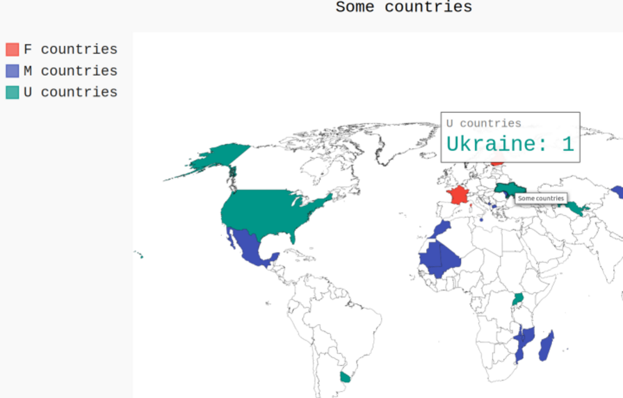

---

## Leather

[Leather](https://leather.readthedocs.io/en/) – це бібліотека мови програмування Python, яка використовується для створення діаграм для тих, кому потрібні негайно діаграми і яким все одно, чи ідеальна діаграма.

Ця бібліотека працює з усіма типами наборів даних. Вона створює вихідні чати даних у вигляді SVG, щоб користувачі могли вимірювати діаграми з найкращою якістю.

Це нова бібліотека, і деякі її документи все ще знаходяться в розробці. Діаграми, створені з використанням цієї бібліотеки, є простими, але хорошої якості, які зроблено приблизно.

##### Приклад

```python
mport
leather

data = [
    (3, 'Hello'),
    (5, 'How'),
    (9, 'Are'),
    (4, 'You')
]

chart = leather.Chart('Bars')
chart.add_bars(data)
chart.to_svg('examples/charts/bars.svg')
```

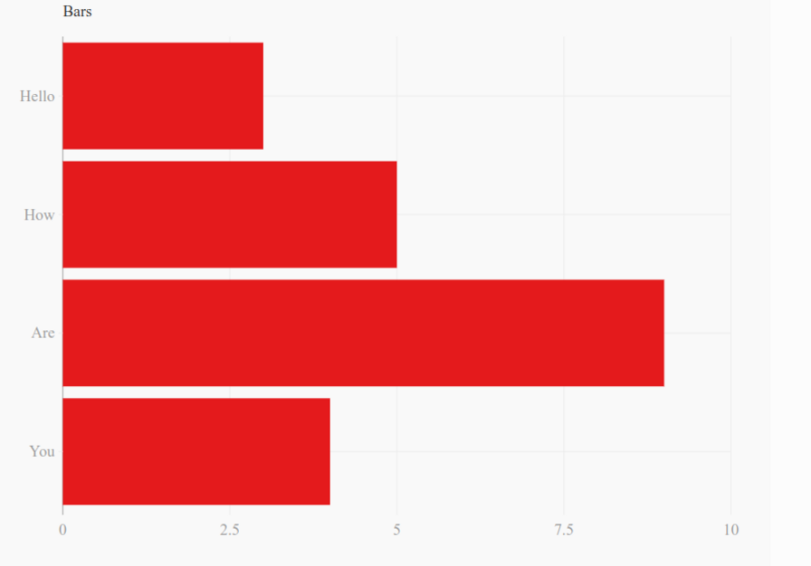

---

## Folium

[Folium](https://python-visualization.github.io/folium/) – це бібліотека, яка спрощує візуалізацію та аналіз даних на інтерактивній карті-буклеті. Ця бібліотека має різні вбудовані набори тайлів із різних платформ, таких як OpenStreetMaps, Stamen та Mapbox.

У бібліотеці Folium легко малювати карти маркерами. Однак інші бібліотеки Python також можуть створювати карти, такі як Altair, boken і Plotly. Бібліотека Folium використовує OpenStreetMap, який дає відчуття карти Google та кілька рядків коду.

Ця бібліотека також спростила додавання можливих розташувань інших користувачів за допомогою маркерів.

##### Приклад

```python
import folium

M = folium.Map(location=[26.987675, 67.989654]) 
```


---

## Geoplotlib

[Geoplotlib](https://github.com/andrea-cuttone/geoplotlib) – це бібліотека мови Python, яка дозволяє користувачеві розробляти карти та наносити на карту географічні дані. Це бібліотека набору інструментів, яка використовується для малювання різних типів карток, таких як теплові картки, точкові карти щільності та картографічні діаграми.

Щоб використовувати бібліотеку geoplotlib, користувачеві необхідно завантажити Pyglet, який є інтерфейсом об'єктноорієнтованої мови програмування. Бібліотека Geoplotlib відображає точки картки на аркушах OpenStreetMap.

Також має функцію масштабування та панорамування карти, щоб користувачі могли бачити більш конкретно. Ця бібліотека автоматично обробляє завантаження всього набору даних, проекцію карти та завантажує фрагменти картки. Вона має графіку, що відображається з OpenGL.

##### Приклад

```python
import json

import geoplotlib
from geoplotlib.colors import ColorMap
from geoplotlib.utils import BoundingBox


# find the unemployment rate of the particular county, and then change it to color 
def get_color(properties):
    key = str(int(properties[' STATE '])) + properties[' COUNTRY ']
    if key in unemployment:
        return cmap.to_color(unemployment.get(key), .15, ' lin ')
    else:
        return [0, 0, 0, 0]


with open(' sample /data /unemployment.json ') as fin:
    unemployment = json.load(fin)
cmap = ColorMap(' Blues ', alpha=255, levels=10)
geoplotlib.geojson(' samples /data/ gz_2010_us_050_00_20m.json ', fill=True, color=get_color,
                   f_tooltip=lambda properties: properties[' NAME '])
geoplotlib.geojson(' samples/ data/ gz_2010_us_050_00_20m.json ', fill=False,
                   color=[255, 255, 255, 64])
geoplotlib.set_bbox(BoundingBox.USA)
geoplotlib.show() 
```

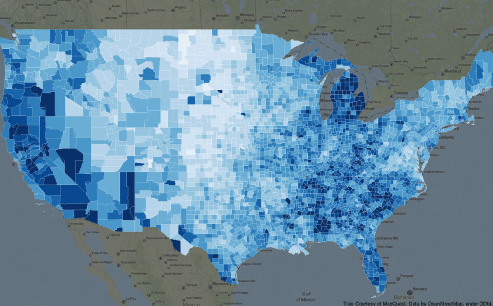

---

## Gleam

[Gleam](https://github.com/dgrtwo/gleam) відповідає пакету Shiny мови програмування R. Ця бібліотека використовується для візуалізації та аналізу даних інтерактивних веб-застосунків, що використовують лише сценарії Python.

Таким чином, користувачам не потрібно вивчати будь-яку іншу мову програмування, наприклад, JavaScript, HTML або CSS.

Використовуючи gleam, користувачам необхідно розробити базовий графік, і вони можуть створювати різні поля на його вершині, а потім легко фільтрувати та сортувати дані.

##### Приклад

```python
from ggplot import *
from gleam import panels
from wtforms import fields


class ScatterInput(panels.Inputs):
    title = fields.StringField(label=" Title of plot : ")
    yvar = fields.SelectField(
        label=" Y axis",
        choices=[(" beef ", " Beef "), (" pork ", " Pork ")])

smoother = fields.BooleanField(label=" Smoothing Curve ")
```

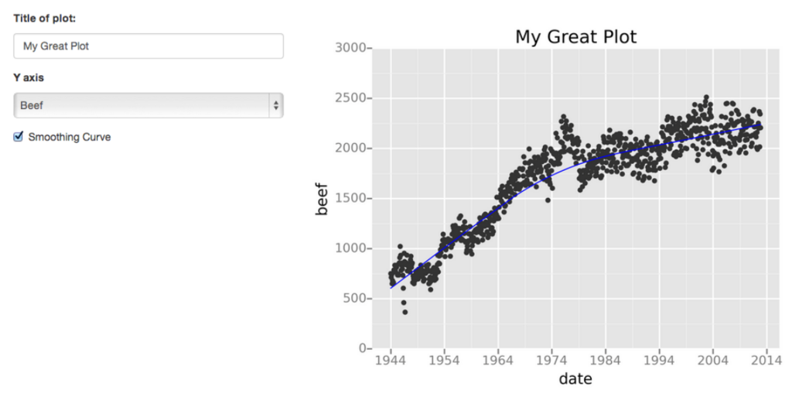

---

## Налаштування робочого середовища для работи з візуальними інструментами

[Практичне заняття 7](../practics/007_p.md)

---

## Висновки до теми

- зробили огляд найпоширеніших інструментів длі візуалізації в Python
- порівняли динамічни та статичні можливості бібліотек і пакетів візуалізації
- з'ясували границі застосування та можливості таких бібліотек 
- розглянули приклади використання
- розглянули стандартні задачі, що може робити аналітик даних 

---

# [Література та посилання](../links.md)

---

# [На головну сторінку ...](../../README.md)
